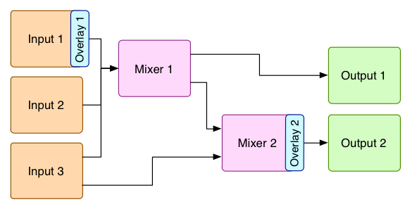

# Mixers
Mixers allow video and audio to be switched and mixed together.

A mixer can have any number of *sources*. Sources can be either [inputs](inputs.md) or the output from other mixers.

[Outputs](outputs.md) can then take a mixer as a source, to deliver its mix elsewhere (e.g. as an RTMP stream, or writing to a file).

Mixers can also have [overlays](overlays.md) applied to them.

There can be any number of mixers. They can be created, updated, and deleted using the [API](api.md). They can also be created at start-up using a [config file](config_file.md).

All together, this allows mixers to be interconnected in interesting ways, for example:

## State
A mixer will be in one of four states - NULL, READY, PAUSED, and PLAYING. (For more, see the FAQ question [_What are the four states?_](faq.md#what-are-the-four-states)). This appears as the `state` field. It can be updated. To initialise with a state other than PLAYING, set `initial_state` in the `props` section.

## Mixer properties
There is only one type of mixer, and it has the following properties:

| Name | Required? | Description | Default value (if not set) |
| ---- | --------- | ----------- | -------------------------- |
| `pattern` | No | The pattern used for the background, as an integer. See the [test video](inputs.md#test-video) input type for the list of available patterns. | 0 (SMPTE 100% color bars) |
| `width` and `height` | No | Override of the width and height | The values of `default_mixer_width` and `default_mixer_height` in the [config file](config_file.md). |
